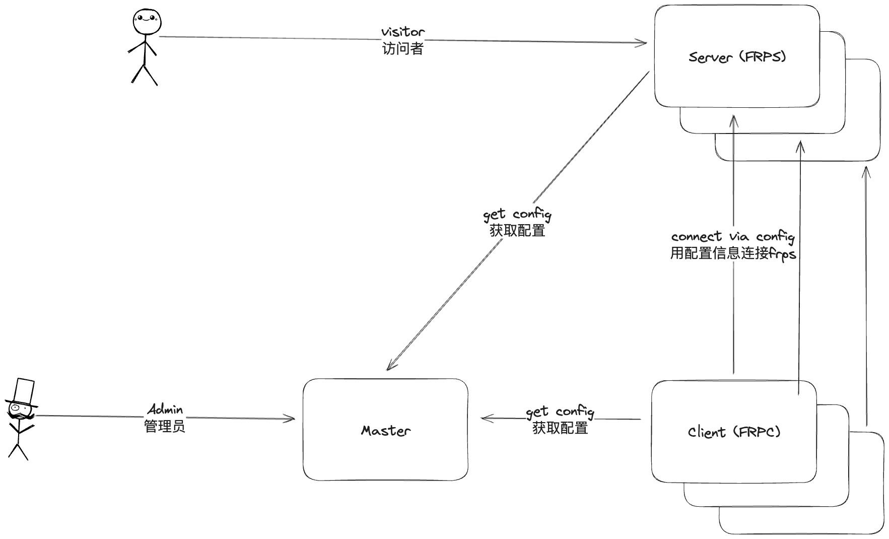
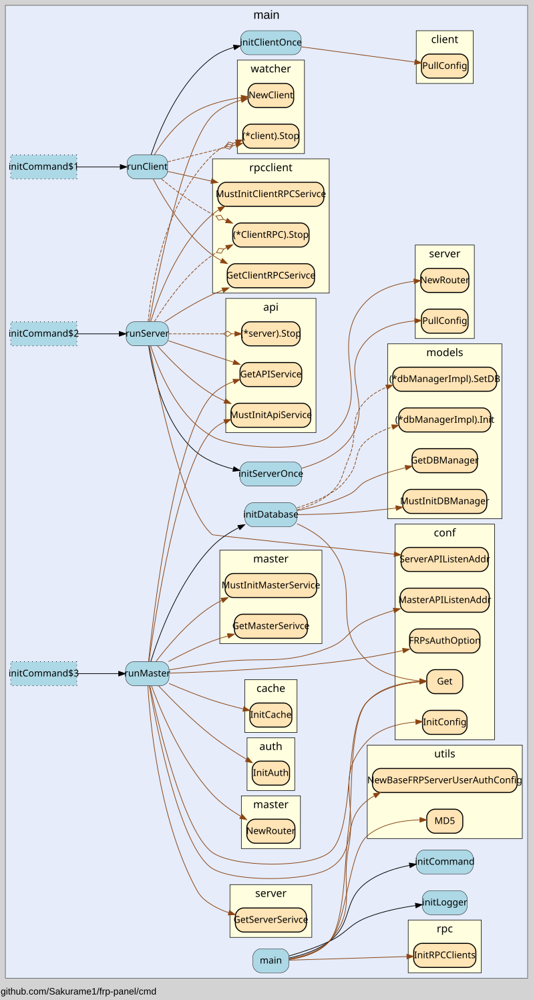

# 璐＄尞鎸囧崡

## 鏂囨。璐＄尞鎸囧崡

璇穎ork鏈粨搴擄紝淇敼浠撳簱鐩綍涓?`docs` 鏂囦欢澶逛腑鐨勫唴瀹?

## 椤圭洰寮€鍙戞寚鍗?

### 骞冲彴鏋舵瀯璁捐

鎶€鏈爤閫夊ソ浜嗭紝涓嬩竴姝ュ氨鏄璁捐绋嬪簭鐨勬灦鏋勩€傚湪鍒氬垰鑳屾櫙閲岃鐨勯偅鏍凤紝frp 鏈韩鏈?frpc 鍜?frps锛堝鎴风鍜屾湇鍔＄锛夛紝杩欎袱涓鑹茶偗瀹氭槸蹇呬笉鍙皯浜嗐€傜劧鍚庢垜浠繕瑕佹柊澧炰竴涓笢瑗垮幓绠＄悊瀹冧滑锛屾墍浠?frp-manager 鏂板浜嗕竴涓?master 瑙掕壊銆俶aster 浼氳礋璐ｇ鐞嗗悇绉?frpc 鍜?frps锛屼腑蹇冨寲鐨勫瓨鍌ㄩ厤缃枃浠跺拰杩炴帴淇℃伅銆?

鐒跺悗鏄?frpc 鍜?frps銆傚師鐗堟槸闇€瑕佸湪涓よ竟鍒嗗埆鍐欓厤缃枃浠剁殑銆傞偅涔堟棦鐒跺師鐗堝凡缁忔敮鎸佷簡锛屽氨涓嶇敤鍦ㄨ蛋鍘熺増鐨勮矾瀛愶紝鎴戜滑鐩存帴涓嶆敮鎸侀厤缃枃浠讹紝鎵€鏈夌殑閰嶇疆閮藉繀椤讳粠 master 鑾峰彇銆?

鍏舵杩樿鑰冭檻鍒颁笌鍘熺増鐨勫吋瀹归棶棰橈紝frp-manager 鐨勫鎴风/鏈嶅姟绔兘蹇呴』瑕佽兘杩炰笂瀹樻柟 frpc/frps 鏈嶅姟銆傝繖鏍风殑璇濆氨鍙互鍋氬埌閰嶇疆鏂囦欢/涓嶈閰嶇疆鏂囦欢閮借兘瀹岀編宸ヤ綔浜嗐€?
鎬荤殑璇存潵鏋舵瀯杩樻槸寰堢畝鍗曠殑銆?



### 寮€鍙?

椤圭洰鍖呭惈涓変釜瑙掕壊

1. Master: 鎺у埗鑺傜偣锛屾帴鍙楁潵鑷墠绔殑璇锋眰骞惰礋璐ｇ鐞?Client 鍜?Server
2. Server: 鏈嶅姟绔紝鍙楁帶鍒惰妭鐐规帶鍒讹紝璐熻矗瀵瑰鎴风鎻愪緵鏈嶅姟锛屽寘鍚?frps 鍜?rpc(鐢ㄤ簬杩炴帴 Master)鏈嶅姟
3. Client: 瀹㈡埛绔紝鍙楁帶鍒惰妭鐐规帶鍒讹紝鍖呭惈 frpc 鍜?rpc(鐢ㄤ簬杩炴帴 Master)鏈嶅姟

鎺ヤ笅鏉ョ粰鍑轰竴涓」鐩腑鍚勪釜鍖呯殑鍔熻兘

```
.
|-- biz                 # 涓昏涓氬姟閫昏緫
|   |-- client          # 瀹㈡埛绔€昏緫锛堣繖閲屾寚鐨勬槸frp-manager鐨勫鎴风锛?
|   |-- master          # frp-manager 鎺у埗骞抽潰锛岃礋璐ｅ鐞嗗墠绔姹傦紝骞朵笖浣跨敤rpc绠＄悊frp-manager鐨剆erver鍜宑lient
|   |   |-- auth        # 璁よ瘉妯″潡锛屽寘鍚敤鎴疯璇佸拰瀹㈡埛绔璇?
|   |   |-- client      # 瀹㈡埛绔ā鍧楋紝鍖呭惈鍓嶇绠＄悊瀹㈡埛绔殑鍚勭API
|   |   |-- server      # 鏈嶅姟绔ā鍧楋紝鍖呭惈鍓嶇绠＄悊鏈嶅姟绔殑鍚勭API
|   |   `-- user        # 鐢ㄦ埛妯″潡锛屽寘鍚敤鎴风鐞嗐€佺敤鎴蜂俊鎭幏鍙栫瓑
|   `-- server          # 鏈嶅姟绔€昏緫锛堣繖閲屾寚鐨勬槸frp-manager鐨勬湇鍔＄锛?
|-- cache               # 缂撳瓨锛岀敤浜庡瓨鍌╢rps鐨勮璇乼oken
|-- cmd                 # 鍛戒护琛屽叆鍙ｏ紝main鍑芥暟鐨勬墍鍦ㄥ湴锛岃礋璐ｆ寜闇€鍚姩鍚勪釜妯″潡
|-- common
|-- conf
|-- dao                 # data access object锛屼换浣曞拰鏁版嵁搴撶浉鍏崇殑鎿嶄綔浼氳皟鐢ㄨ繖涓簱
|-- doc                 # 鏂囨。
|-- idl                 # idl瀹氫箟
|-- middleware          # api鐨勪腑闂翠欢锛屽寘鍚獼WT鍜宑ontext鐩稿叧锛岀敤浜庡鐞哸pi璇锋眰锛岄壌鏉冮€氳繃鍚庝細鎶婄敤鎴蜂俊鎭敞鍏ュ埌context锛屽彲浠ラ€氳繃common鍖呰幏鍙?
|-- models              # 鏁版嵁搴撴ā鍨嬶紝鐢ㄤ簬瀹氫箟鏁版嵁搴撹〃銆傚悓鏃跺寘鍚疄浣撳畾涔?
|-- pb                  # protobuf鐢熸垚鐨刾b鏂囦欢
|-- rpc                 # 鍚勭rpc鐨勬墍鍦ㄥ湴锛屽寘鍚獵lient/Server璋冪敤Master鐨勯€昏緫锛屼篃鍖呭惈Master浣跨敤Stream璋冪敤Client鍜孲erver鐨勯€昏緫
|-- services            # 鍚勭闇€瑕佸湪鍐呭瓨涓寔涔呰繍琛岀殑妯″潡锛岃繖涓寘鍙互绠＄悊鍚勪釜鏈嶅姟鐨勮繍琛?鍋滄
|   |-- api             # api鏈嶅姟锛岃繍琛岄渶瑕佸閮ㄤ紶鍏ヤ竴涓猤inRouter
|   |-- client          # frp鐨勫鎴风锛屽嵆frpc锛屽彲浠ユ帶鍒秄rpc鐨勫悇绉嶉厤缃?寮€濮嬩笌鍋滄
|   |-- master          # master鏈嶅姟锛屽寘鍚玶pc鐨勬湇鍔＄瀹氫箟锛屾帴鏀跺埌rpc璇锋眰鍚庝細璋冪敤biz鍖呭鐞嗛€昏緫
|   |-- rpcclient       # 鏈夌姸鎬佺殑rpc瀹㈡埛绔紝鍥犱负rpc鐨刢lient閮芥病鏈夊叕缃慽p锛屽洜姝ゅ湪rpc client鍚姩鏃朵細璋冪敤master鐨剆tream闀胯繛鎺pc锛屽缓绔嬭繛鎺ュ悗Master鍜孋lient閫氳繃杩欎釜鍖呴€氫俊
|   `-- server          # frp鐨勬湇鍔＄锛屽嵆frps锛屽彲浠ユ帶鍒秄rps鐨勫悇绉嶉厤缃?寮€濮嬩笌鍋滄
|-- tunnel              # tunnel妯″潡锛岀敤浜庣鐞唗unnel锛屼篃灏辨槸绠＄悊frpc鍜宖rps鏈嶅姟
|-- utils
|-- watcher             # 瀹氭椂杩愯鐨勪换鍔★紝姣斿姣?0绉掓洿鏂颁竴娆￠厤缃枃浠?
`-- www
    |-- api
    |-- components # 杩欓噷闈㈡湁涓€涓猘pitest缁勪欢鐢ㄤ簬娴嬭瘯
    |   `-- ui
    |-- lib
    |   `-- pb
    |-- pages
    |-- public
    |-- store
    |-- styles
    `-- types

```

### 璋冭瘯鍚姩鏂瑰紡锛?

- master: `go run cmd/*.go master`
  > client 鍜?server 鐨勫叿浣撳弬鏁拌澶嶅埗 master webui 涓殑鍐呭
- client: `go run cmd/*.go client -i <clientID> -s <clientSecret>`
- server: `go run cmd/*.go server -i <serverID> -s <serverSecret>`

椤圭洰閰嶇疆鏂囦欢浼氶粯璁よ鍙栧綋鍓嶆枃浠跺す涓嬬殑.env 鏂囦欢锛岄」鐩唴缃簡鏍蜂緥閰嶇疆鏂囦欢锛屽彲浠ユ寜鐓ц嚜宸辩殑闇€姹傝繘琛屼慨鏀?

璇︾粏鏋舵瀯璋冪敤鍥?



### 鏈綋閰嶇疆璇存槑

[settings.go](https://github.com/Sakurame1/frp-manager/blob/main/conf/settings.go)
杩欓噷鏈夎缁嗙殑閰嶇疆鍙傛暟瑙ｉ噴锛岄渶瑕佽繘涓€姝ヤ慨鏀归厤缃鍙傝€冭鏂囦欢
