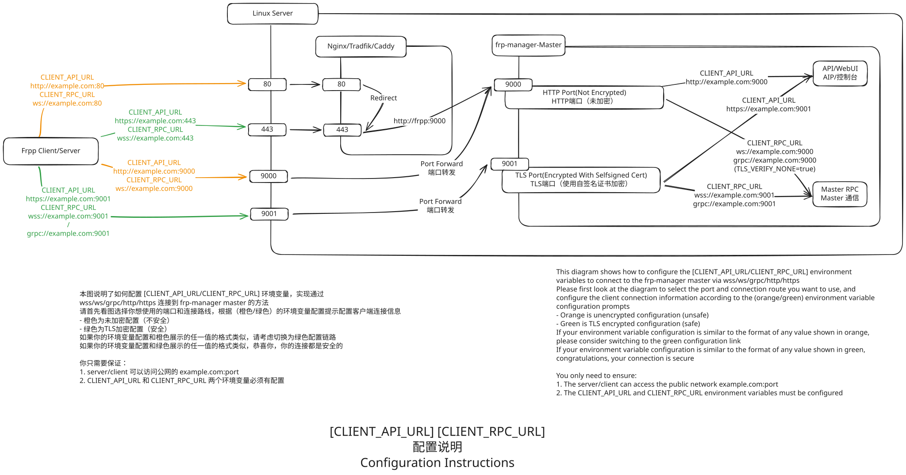

# Master 閮ㄧ讲

Master 鎺ㄨ崘浣跨敤 docker 閮ㄧ讲锛佷笉鎺ㄨ崘鐩存帴瀹夎鍒版湇鍔″櫒涓?

浼氱粰鍑轰笁绉嶉儴缃叉柟寮忥紝浠婚€変竴绉嶅嵆鍙?

閮ㄧ讲鍚庢病鏈夐粯璁ょ敤鎴凤紝娉ㄥ唽鐨勭涓€涓敤鎴峰嵆涓虹鐞嗗憳锛屼负浜嗗畨鍏紝榛樿涓嶅紑鍚鐢ㄦ埛娉ㄥ唽

绋嬪簭鐨勯粯璁ゅ瓨鍌ㄦ暟鎹矾寰勫拰绋嬪簭鏂囦欢鍚岀洰褰曪紝濡傞渶淇敼璇峰弬鑰冮厤缃〃鏍?

閲嶈锛侊細濡傛灉浣犳兂鍙儴缃?master锛屽悓鏃朵綔涓?server 杩愯锛岃涓嶈蹇樿鍚姩 master 鍚庯紝鍦?webui 鐨勯厤缃湇鍔＄涓慨鏀?default 鐨勯厤缃?

## 鍓嶆湡鍑嗗

### 鏈嶅姟鍣ㄥ紑鏀惧叕缃戠鍙ｏ細

- **WEBUI 绔彛**: 榛樿 `TCP 9000`
- **RPC 绔彛**: 榛樿 `TCP 9001`
- **frps 鐨凙PI绔彛**锛氭病鏈夐粯璁わ紝璇烽殢鎰忛鐣欙紝渚嬪瓙浣跨敤 `TCP/UDP 7000`
- **frps 瀵瑰寮€鏀剧殑鏈嶅姟绔彛**锛氭病鏈夐粯璁わ紝璇烽殢鎰忛鐣欙紝渚嬪瓙浣跨敤 `TCP/UDP 26999-27050`

濡傛灉浣跨敤鍙嶅悜浠ｇ悊锛岃蹇界暐 WEBUI 鍜?RPC 绔彛锛屾斁琛?80/443 鍗冲彲

WEBUI 绔彛涔熷彲浠ュ鐞?h2c 鏍煎紡鐨?RPC 杩炴帴

RPC 绔彛涔熷彲浠ュ鐞嗚嚜绛惧悕 HTTPS 鐨?API 杩炴帴

浜岃€呴兘鍙娇鐢ㄥ弽鍚戜唬鐞嗘湇鍔″櫒杩炴帴骞舵彁渚汿LS

濡傛灉浣犳兂瑕佷娇鐢ㄥ畨鍏ㄧ殑鏂瑰紡锛堝弽鍚戜唬鐞嗭級锛岃鍙傝€冧笅鍥捐缃幆澧冨彉閲忋€宍CLIENT_RPC_URL`鍜宍CLIENT_API_URL`銆嶃€?

娉ㄦ剰鈿狅笍锛氳棣栧厛浣跨敤鏅€氶儴缃茬殑鏂瑰紡閮ㄧ讲鎴愬姛锛佺劧鍚庡啀鏉ヨ皟鏁磋繖涓や釜鍙橀噺锛侊紒锛侊紒

姗欒壊鏄笉瀹夊叏锛岀豢鑹叉槸瀹夊叏銆備綘闇€瑕佷繚璇佷袱涓幆澧冨彉閲忛兘鏈夎缃紝鎵嶈兘姝ｅ父宸ヤ綔



> 娴嬭瘯绔彛鏄惁寮€鏀剧殑鏂规硶锛堜互8080涓轰緥锛夛紝鍦ㄦ湇鍔″櫒涓婅繍琛岋細
> ```shell
> python3 -m http.server 8080
> ```
> 鐒跺悗鍦ㄥ彟涓€鍙扮數鑴?鏈嶅姟鍣ㄤ笂鎵ц锛?
> ```shell
> curl http://鏈嶅姟鍣ㄥ叕缃慖P/鍩熷悕:8080 -I
> ```
> 鎴愬姛鐨勮瘽锛岃緭鍑虹被浼?
> ```
> HTTP/1.0 200 OK
> Server: SimpleHTTP/0.6 Python/3.11.0
> Date: Sat, 12 Apr 2025 17:12:15 GMT
> Content-type: text/html; charset=utf-8
> Content-Length: 8225
> ```

## 鍦?Linux 涓婇儴缃?

### 鏂瑰紡涓€锛欴ocker Compose 閮ㄧ讲

鏈嶅姟鍣ㄩ渶瑕佸畨瑁卍ocker鍜宒ocker compose

棣栧厛鍒涘缓涓€涓猔docker-compose.yaml`鏂囦欢锛屽啓鍏ヤ互涓嬪唴瀹?

```yaml
services:
  frpp-master:
    image: sakurame1/frp-manager:1.0.0
    network_mode: host
    environment:
      APP_GLOBAL_SECRET: your_secret # 闅忎究杈撳叆涓€浜涢殢鏈哄瓧绗︼紝涓嶈娉勯湶
      MASTER_RPC_HOST: 1.2.3.4 # 鏈嶅姟鍣ㄧ殑澶栭儴IP鎴栧煙鍚?
      MASTER_RPC_PORT: 9001 # RPC 鐩戝惉绔彛
      MASTER_API_HOST: 1.2.3.4 # 鏈嶅姟鍣ㄧ殑澶栭儴IP鎴栧煙鍚?
      MASTER_API_PORT: 9000 # API/WebUI鐩戝惉绔彛
      # CLIENT_RPC_URL鍜孋LIENT_API_URL璇锋牴鎹疄闄呮儏鍐佃缃紝璁剧疆涓哄閮ㄥ彲浠ラ€氳繃url璁块棶鍒癿aster鐨勫舰寮?
      # Client 杩炴帴 master RPC 鐨?URL锛屽鏋滀娇鐢ㄥ弽鍚戜唬鐞嗭紝璇疯缃负閫氳繃鍙嶅悜浠ｇ悊璁块棶鐨?URL锛堝wss://example.com:443锛?
      CLIENT_RPC_URL: grpc://1.2.3.4:9001
      # Client 杩炴帴 master API/WebUI 鐨?URL锛屽鏋滀娇鐢ㄥ弽鍚戜唬鐞嗭紝璇疯缃负閫氳繃鍙嶅悜浠ｇ悊璁块棶鐨?URL锛堝https://example.com:443锛?
      CLIENT_API_URL: http://1.2.3.4:9000
    volumes:
      - ./data:/data # 鏁版嵁瀛樺偍浣嶇疆
    restart: unless-stopped
    command: master
```

### 鏂瑰紡浜岋細Docker 鍛戒护閮ㄧ讲

鏈嶅姟鍣ㄩ渶瑕佸畨瑁?docker锛屾垜浠帹鑽愪娇鐢?host 缃戠粶妯″紡閮ㄧ讲 `Master`

```bash
# 鎺ㄨ崘
# MASTER_RPC_HOST绛?.0.0.0瑕佹敼鎴愪綘鏈嶅姟鍣ㄧ殑澶栭儴IP
# APP_GLOBAL_SECRET娉ㄦ剰涓嶈娉勬紡锛屽鎴风鍜屾湇鍔＄鐨勬槸閫氳繃Master鐢熸垚鐨?
# CLIENT_RPC_URL鍜孋LIENT_API_URL璇锋牴鎹疄闄呮儏鍐佃缃?
# 濡傛灉浣跨敤鍙嶅悜浠ｇ悊锛岃璁剧疆涓洪€氳繃鍙嶅悜浠ｇ悊璁块棶鐨?URL锛屼篃灏辨槸澶栭儴濡備綍璁块棶master
# 濡?443绔彛浠ｇ悊example.com鍒?000绔彛
# CLIENT_RPC_URL=wss://example.com:443
# CLIENT_API_URL=https://example.com:443
docker run -d \
	--network=host \
	--restart=unless-stopped \
	-v /opt/frp-manager:/data \
	-e APP_GLOBAL_SECRET=your_secret \
	-e MASTER_RPC_HOST=0.0.0.0 \
	-e CLIENT_RPC_URL=grpc://0.0.0.0:9001 \
	-e CLIENT_API_URL=http://0.0.0.0:9000 \
	sakurame1/frp-manager
```

濡傛灉浣犱笉鎯充娇鐢?host 缃戠粶妯″紡锛岃鍙傝€冧娇鐢ㄤ笅闈㈢殑鍛戒护淇敼

```bash
# 鎴栬€?
# 杩愯鏃惰寰楀垹闄ゅ懡浠や腑鐨勪腑鏂?
# CLIENT_RPC_URL鍜孋LIENT_API_URL璇锋牴鎹疄闄呮儏鍐佃缃紝璁剧疆涓哄閮ㄥ彲浠ラ€氳繃url璁块棶鍒癿aster鐨勫舰寮?
# 濡傛灉浣跨敤鍙嶅悜浠ｇ悊锛岃璁剧疆涓洪€氳繃鍙嶅悜浠ｇ悊璁块棶鐨?URL锛屼篃灏辨槸澶栭儴濡備綍璁块棶master
docker run -d -p 9000:9000 \ # API鎺у埗鍙扮鍙?
	-p 9001:9001 \ # rpc绔彛
	-p 7000:7000 \ # frps 绔彛
	-p 27000-27050:27000-27050 \ # 缁檉rps棰勭暀鐨勭鍙?
	--restart=unless-stopped \
	-v /opt/frp-manager:/data \ # 鏁版嵁瀛樺偍浣嶇疆
	-e APP_GLOBAL_SECRET=your_secret \ # Master鐨剆ecret娉ㄦ剰涓嶈娉勬紡锛屽鎴风鍜屾湇鍔＄鐨勬槸閫氳繃Master鐢熸垚鐨?
	-e MASTER_RPC_HOST=0.0.0.0 \ # 杩欓噷瑕佹敼鎴愪綘鏈嶅姟鍣ㄧ殑澶栭儴IP
	-e CLIENT_RPC_URL=grpc://0.0.0.0:9001 \
	-e CLIENT_API_URL=http://0.0.0.0:9000 \
	sakurame1/frp-manager
```

### 鏂瑰紡涓夛細浣跨敤 docker 鍙嶅悜浠ｇ悊 TLS 鍔犲瘑閮ㄧ讲

杩欓噷鎴戜滑浠?[Traefik](https://traefik.io/traefik/) 涓轰緥

> `Traefik` 鍙互瀹炴椂鑷姩璇嗗埆 Docker 瀹瑰櫒鐨勭鍙ｅ苟鐑洿鏂伴厤缃紝闈炲父閫傚悎 Docker 鏈嶅姟鐨勫弽鍚戜唬鐞?

棣栧厛鍒涘缓涓€涓悕涓篳traefik`鐨勫弽鍚戜唬鐞嗕笓鐢ㄧ綉缁?
```bash
docker network create traefik
```
鐒跺悗鍚姩鍙嶅悜浠ｇ悊鍜?Master 鏈嶅姟
- `docker-compose.yaml`

```yaml
version: '3'

services:
  traefk-reverse-proxy:
    image: traefik:v3.3
    restart: unless-stopped
    networks:
      - traefik
    command:
      - --entryPoints.web.address=:80
      - --entryPoints.websecure.address=:443
      - --entryPoints.websecure.http2.maxConcurrentStreams=250
      - --providers.docker
      - --providers.docker.network=traefik
      - --api.insecure # 鍦ㄧ敓浜х幆澧冭鍒犻櫎杩欎竴琛?
    # 杩欎笅闈娇鐢?80 绔彛鍋欰CME HTTP DNS璇佷功楠岃瘉
      - --certificatesresolvers.le.acme.email=me@example.com
      - --certificatesresolvers.le.acme.storage=/etc/traefik/conf/acme.json
      - --certificatesresolvers.le.acme.httpchallenge=true
    ports:
      # 鍙嶅悜浠ｇ悊鐨?HTTP 绔彛
      - "80:80"
      # 鍙嶅悜浠ｇ悊鐨?HTTPS 绔彛
      - "443:443"
      # Traefik 鐨?Web UI (--api.insecure=true 浼氫娇鐢ㄨ繖涓鍙?
      # 鐢熶骇鐜璇峰垹闄よ繖涓鍙?
      - "8080:8080"
    volumes:
      # 鎸傝浇 docker.sock锛岃繖鏍?Traefik 鍙互鑷姩璇嗗埆涓绘満涓婃墍鏈?docker 瀹瑰櫒鍙嶅悜浠ｇ悊閰嶇疆
      - /var/run/docker.sock:/var/run/docker.sock
      # 淇濆瓨 Traefik 鐢宠鐨勮瘉涔?
      - ./conf:/etc/traefik/conf

  frpp-master:
    image: sakurame1/frp-manager:1.0.0 # 杩欓噷鎹㈡垚浣犳兂浣跨敤鐨勭増鏈?    environment:
      APP_GLOBAL_SECRET: your_secret
	# 鍥犱负 api 鍜?rpc 浣跨敤鐨勫崗璁笉涓€鏍?
	# 鎴戜滑闇€瑕佸 api 鍜?rpc 浣跨敤涓や釜鍩熷悕
	# 浠ヤ究鍙嶅悜浠ｇ悊姝ｇ‘璇嗗埆闇€瑕佽浆鍙戠殑鍗忚
      MASTER_RPC_HOST: frpp.example.com
      MASTER_API_PORT: 443
      MASTER_API_HOST: frpp.example.com
      MASTER_API_SCHEME: https
      CLIENT_RPC_URL: wss://frpp.example.com:443
      CLIENT_API_URL: https://frpp.example.com:443
    networks:
      - traefik
    volumes:
      - ./data:/data
    ports:
	  # 鏃犻渶涓?master 棰勭暀 api 鍜?rpc 绔彛
	  # 棰勭暀frps api绔彛
      - 7000:7000
      - 7000:7000/udp
	  # 棰勭暀frps鐨勪笟鍔＄鍙?
	  # 26999 绔彛鏄暀缁?frps 鐨刪ttp浠ｇ悊绔彛
      - 26999-27050:26999-27050
      - 26999-27050:26999-27050/udp
    restart: unless-stopped
    command: master
    labels:
	  # API/WSS
      - traefik.http.routers.frp-manager-api.rule=Host(`frpp.example.com`)
      - traefik.http.routers.frp-manager-api.tls=true
      - traefik.http.routers.frp-manager-api.tls.certresolver=le
      - traefik.http.routers.frp-manager-api.entrypoints=websecure
      - traefik.http.routers.frp-manager-api.service=frp-manager-api
      - traefik.http.services.frp-manager-api.loadbalancer.server.port=9000
      - traefik.http.services.frp-manager-api.loadbalancer.server.scheme=http
      # 涓嬫柟濡傛灉浣犵敤涓嶅埌 frps 鐨刪ttp浠ｇ悊锛屽彲浠ヤ笉瑕?
      # 闇€瑕侀厤缃煙鍚?*.frpp.example.com 娉涜В鏋愬埌浣犳湇鍔″櫒鐨勫叕缃慖P
      # 杩欐牱鍙互瀹炵幇浣跨敤 .frpp.example.com 缁撴潫鐨勫煙鍚嶏紝鍦?443 绔彛锛岃浆鍙戝涓湇鍔″埌澶氫釜 frpc
      - traefik.http.routers.frp-manager-tunnel.rule=HostRegexp(`.*.frpp.example.com`)
      - traefik.http.routers.frp-manager-tunnel.tls.domains[0].sans=*.frpp.example.com
      - traefik.http.routers.frp-manager-tunnel.tls=true
      - traefik.http.routers.frp-manager-tunnel.tls.certresolver=le
      - traefik.http.routers.frp-manager-tunnel.entrypoints=websecure
      - traefik.http.routers.frp-manager-tunnel.service=frp-manager-tunnel
      - traefik.http.services.frp-manager-tunnel.loadbalancer.server.port=26999
      - traefik.http.services.frp-manager-tunnel.loadbalancer.server.scheme=http
networks:
  traefik:
    external: true
    name: traefik
```

涓婃柟鐨?`docker-compose.yaml` 閮ㄧ讲瀹屾垚鍚庯紝鍙互璁块棶 `鏈嶅姟鍣ㄥ叕缃慖P/鍩熷悕:8080` 鏌ョ湅鍙嶅悜浠ｇ悊鐘舵€?

闅忓悗閰嶇疆 default server 鍗冲彲瀹炵幇 frp 瀛愬煙鍚嶈浆鍙戯細

| 閰嶇疆椤?| 鍊?|
|----|-----|
|	FRPs 鐩戝惉绔彛	|	7000	|
|	FRPs 鐩戝惉鍦板潃	|	0.0.0.0	|
|	浠ｇ悊鐩戝惉鍦板潃	|	0.0.0.0	|
| 	HTTP 鐩戝惉绔彛	|	26999	|
|	鍩熷悕鍚庣紑		|	frpp.example.com	|

## 鍦?Windows 涓婇儴缃?

### 鐩存帴杩愯

鍦ㄤ笅杞界殑鍙墽琛屾枃浠跺悓鍚嶆枃浠跺す涓嬪垱寤轰竴涓?`.env` 鏂囦欢(娉ㄦ剰涓嶈鏈夊悗缂€鍚?锛岀劧鍚庤緭鍏ヤ互涓嬪唴瀹逛繚瀛樺悗杩愯瀵瑰簲鍛戒护

```
APP_GLOBAL_SECRET=your_secret
DB_DSN=data.db
CLIENT_RPC_URL=grpc://IP:9001
CLIENT_API_URL=http://IP:9000
```

- master: `frp-manager-amd64.exe master`
