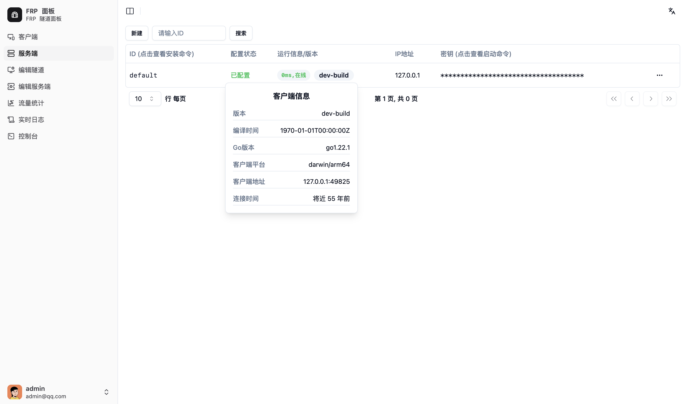

# Server 閮ㄧ讲

Server 鎺ㄨ崘浣跨敤 docker 閮ㄧ讲锛佷笉鎺ㄨ崘鐩存帴瀹夎鍒版湇鍔″櫒涓?

娉ㄦ剰 鈿狅笍锛歝lient 鍜?server 鐨勫惎鍔ㄦ寚浠ゅ彲鑳戒細闅忕潃椤圭洰鏇存柊鑰屾敼鍙橈紝铏界劧鍦ㄩ」鐩凯浠ｆ椂浼氭敞鎰忓墠鍚庡吋瀹癸紝浣嗕粛闅句互瀹屽叏閫傞厤锛屽洜姝?client 鍜?server 鐨勫惎鍔ㄦ寚浠や互 master 鐢熸垚涓哄噯

> `default` 鏈嶅姟绔姝㈠崟鐙儴缃诧紝鐩存帴鍦?webui 涓厤缃嵆鍙€傞噸澶嶉儴缃蹭細閫犳垚 `default` 鏈嶅姟绔棤娉曟甯稿伐浣溿€?

> `server` 浼氬崰鐢?8999 绔彛锛岃纭繚璇ョ鍙ｆ湭琚崰鐢ㄣ€傚鏋滃啿绐侊紝璇蜂慨鏀?`server` 鐨?`SERVER_API_PORT` 鍜?`INTERNAL_FRP_AUTH_SERVER_PORT` 鐜鍙橀噺锛岃纭繚涓や釜绔彛涓€鑷淬€俙default` 鏈嶅姟绔篃浼氬崰鐢ㄨ繖涓鍙ｏ紝鍥犳涓嶈兘鍦ㄥ悓涓€鍙版満鍣ㄤ互**榛樿閰嶇疆**閮ㄧ讲 `server` 鍜?`default` 鏈嶅姟绔紝闇€瑕佷慨鏀?`server` 鐨勭幆澧冨彉閲忔潵閬垮厤鍐茬獊銆?

> 濡傛灉鍙湁涓€鍙板叕缃戞湇鍔″櫒闇€瑕佺鐞嗭紝閭ｄ箞浣跨敤 `master` 鑷甫鐨?`default` 鏈嶅姟绔嵆鍙紝鏃犻渶鍗曠嫭閮ㄧ讲 `server`锛屼絾瑕佹敞鎰忓湪 `master` 鍚姩鍚庤閰嶇疆 `default` 鏈嶅姟绔?

## 鍦?Linux 涓婇儴缃?

### 1. 鍑嗗

鎵撳紑 Master 鐨?webui 骞剁櫥褰曪紝濡傛灉娌℃湁璐﹀彿锛岃鐩存帴娉ㄥ唽锛岀涓€涓敤鎴峰嵆涓虹鐞嗗憳

鍦ㄤ晶杈规爮璺宠浆鍒?`鏈嶅姟绔痐锛岀偣鍑讳笂鏂圭殑 `鏂板缓` 骞惰緭鍏?鏈嶅姟绔?鐨勫敮涓€璇嗗埆ID鍜?鏈嶅姟绔?鑳藉琚叕缃戣闂殑 IP/鍩熷悕锛岀劧鍚庣偣鍑讳繚瀛?



鍒锋柊鍚庯紝鏂扮殑鏈嶅姟绔細鍑虹幇鍦ㄥ垪琛ㄤ腑銆傜偣鍑诲搴旀湇鍔＄鐨刞瀵嗛挜 (鐐瑰嚮鏌ョ湅鍚姩鍛戒护)`涓€鍒椾腑鐨勯殣钘忓瓧娈碉紝澶嶅埗绫讳技鐨勫惎鍔ㄥ懡浠ゅ涓嬪鐢細

```bash
frp-manager server -s abc -i user.s.server1 --api-url http://frpp.example.com:9000 --rpc-url grpc://frpp-rpc.example.com:9001
```

娉ㄦ剰锛屽鏋滀綘浣跨敤 鍙嶅悜浠ｇ悊 TLS锛岄渶瑕佷互 http 涓婃父鐨勫舰寮忥紝澶栭儴 443 绔彛浠ｇ悊 `master` 鐨?9000(API) 绔彛锛屼笖淇敼鍚姩/瀹夎鍛戒护绫讳技濡備笅锛?

```bash
frp-manager server -s abc -i user.s.server1 --api-url https://frpp.example.com:443 --rpc-url wss://frpp.example.com:443
```

### 2. 绋嬪簭瀹夎

#### Docker Compose 閮ㄧ讲

docker-compose.yaml

```yaml
version: '3'
services:
  frp-manager-server:
    image: sakurame1/frp-manager
    container_name: frp-manager-server
    network_mode: host
    restart: unless-stopped
    command: server -s abc -i user.s.server1 --api-url http://frpp.example.com:9000 --rpc-url grpc://frpp-rpc.example.com:9001
```

#### 鐩存帴杩愯

濡傛灉浣犳兂瑕佺洿鎺ヨ繍琛岋紝涓嶄娇鐢ㄦ湇鍔＄鐞嗗伐鍏凤紝璇峰弬鑰?client 鐩存帴杩愯鐨勬楠?

#### 瀹夎涓?systemd 鏈嶅姟

璇峰弬鑰?client 閮ㄧ讲 systemd 鐨勬楠?

### 3. 鏈嶅姟绔厤缃?

瀹夎瀹屽悗闇€瑕佹寜浣犵殑缃戠粶鍜岄渶姹傦紝淇敼鏈嶅姟绔殑閰嶇疆锛屽惁鍒欏鎴风鏃犳硶姝ｅ父杩炴帴

## 鍦?Windows 涓婇儴缃?

璇峰弬鑰?client 閮ㄧ讲鐨勬楠?
