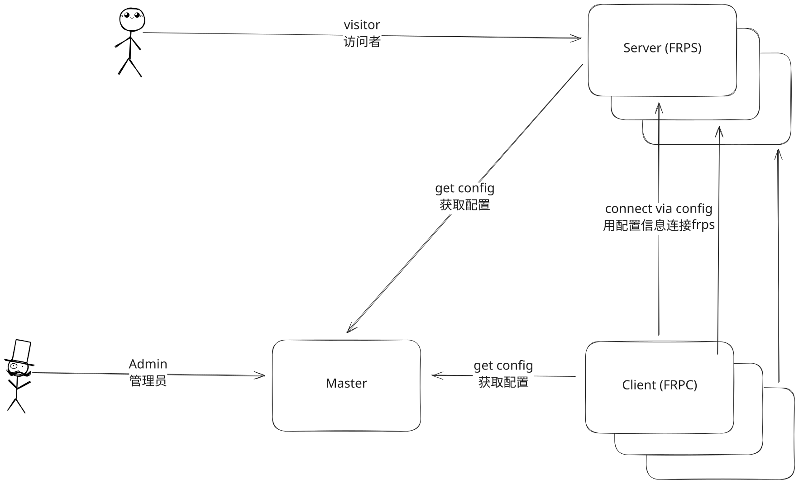

# Quick Start

## Before You Begin

`frp-manager` consists of three modules:

1. `master`: the central control module, responsible for distributing configuration files and managing all other modules  
2. `server`: corresponds to `frps`, responsible for providing traffic entry points  
3. `client`: corresponds to `frpc`, which exposes local services to a specific entry point on the `server`  

> When you deploy the `master`, it will automatically start a default 鈥渄efault server鈥?for clients to connect to. Therefore, the `master` is normally not used on its own, though you can choose to disable this feature.

In a typical deployment, we start with the `master`. When deploying `server` and `client` instances managed by the `master`, you will need the information automatically generated in the `master`鈥檚 web console after it has been successfully deployed.

For `frp-manager`, **we recommend deploying all components via Docker** and **using the `host` network mode**, unless you need remote terminal access to the target machine, in which case you may install the services directly on the host.

## Download Instructions

frp-manager supports deployment via Docker or direct execution. To deploy directly, download the release files here: [release](https://github.com/XMRayLabs/Frp-Manager/releases)

Note: There are two binary versions鈥攐ne is client-only, and the other is a full-featured executable. We recommend using the full-featured executable.

The client-only version can only execute the `client` command (no client parameters required) and its filename includes the 鈥渃lient鈥?identifier.

After starting, the default example can be accessed at `http://IP:9000`

Set `APP_ENABLE_REGISTER=true` only while creating the first administrator in a restricted environment. After the account is created, set it back to `false` and restart Master. An empty database no longer enables public registration implicitly.

> If you have questions about the configuration during deployment, please refer to the [Configuration Guide](./all-configs.md)  
> We recommend keeping this page open for reference.

## Architecture Diagram

